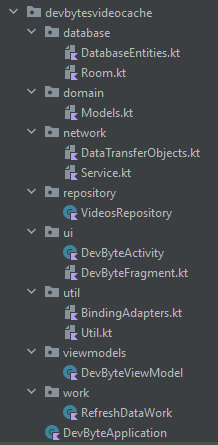
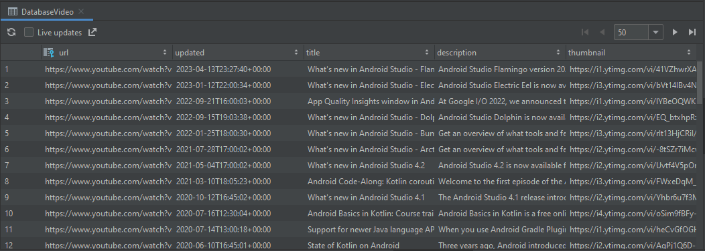

# Dev Bytes Video Cache 🎬

Project created for the Udacity nanodegree Android Kotlin Developer program.

What is a mobile application that can’t obtain data in real time through the internet? While customers demand up to date and reliable data, not all access is created equal. Not only do developers have to be concerned with bandwidth due to data rates, but also connection speeds or availability altogether.

## Key Features ✨

- Navigation
- Retrofit
- Moshi
- Coroutines
- Glide
- Work Manager
- Worker
- Room
- Timber
- Data Binding
- MVVM

## Project Milestones

- DB Cache
- Building Room Database
- Entity | Dto | Dao
- Build Repository
- Background WorkManager
- Worker
- Schedule Background Work
- Caching
- Handling no Internet Connection

## Overview

| Online Caching                              | Offline Repository                            |
|---------------------------------------------|-----------------------------------------------|
|  |  |

### Project Structure

### Database

